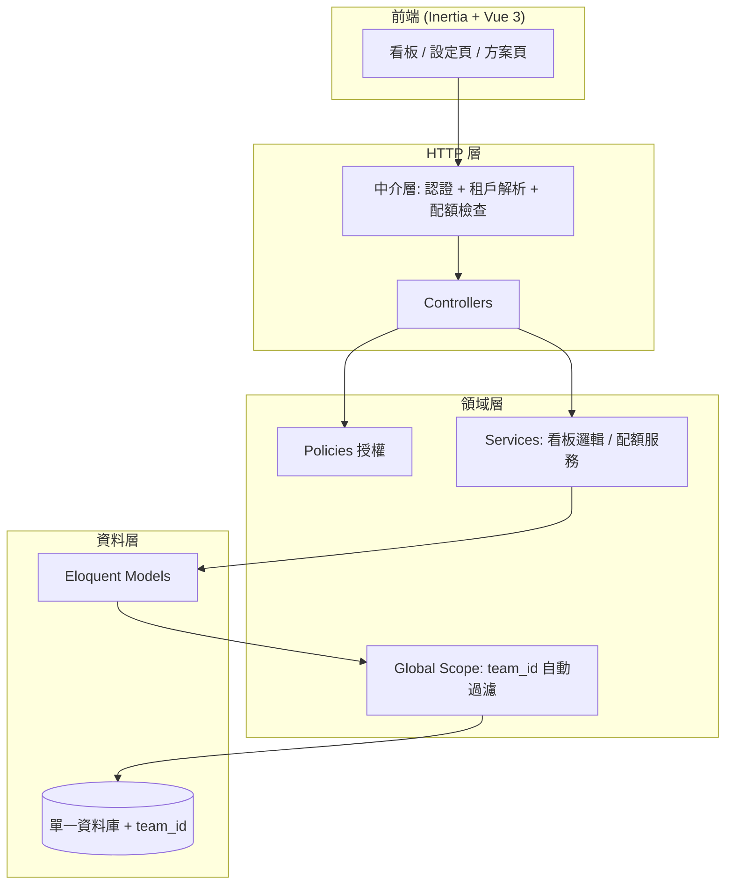
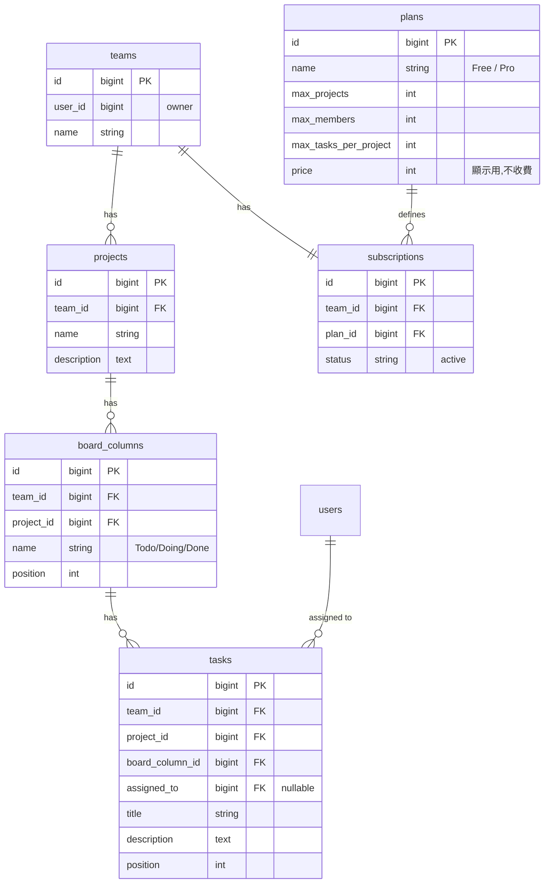
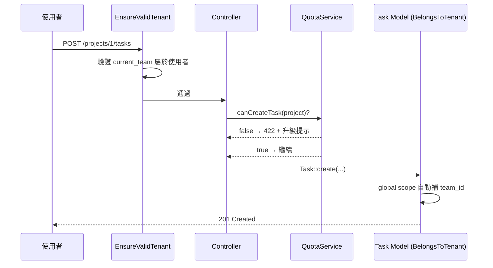

# 多租戶 SaaS 任務看板平台 — 設計文件

- 日期：2026-06-10
- 狀態：已核可，待轉為實作計畫
- 類型：Side project（學習導向）

## 1. 目標與範圍

打造一個多租戶 SaaS 平台 side project，產品題材為**團隊任務看板**（Trello 簡版）。
題材本身業務邏輯單純，作為載體用來完整練習多租戶平台的核心挑戰：

- 租戶資料隔離
- 團隊成員與角色權限
- 訂閱方案與配額限制

學習重點在「多租戶架構」而非業務功能。

## 2. 關鍵決策

| 主題 | 決策 | 理由 |
| --- | --- | --- |
| 產品題材 | 團隊任務看板 | CRUD 結構清楚、成員/權限自然、能聚焦架構 |
| 隔離策略 | 共享資料庫 + `team_id` 欄位（共享 schema） | side project 甜蜜點，可完整練 global scope / 授權 / 配額 |
| 租戶基礎 | Jetstream Teams（一個 Team = 一個租戶） | 現成的團隊建立、切換、邀請、角色，省大量樣板 |
| 訂閱 | 功能性配額，不接金流（Free / Pro） | 練完整「方案→配額→超限」鏈路，不陷入金流串接 |
| 前端 | Inertia + Vue 3 | 與 Jetstream 預設契合，Teams/設定頁元件現成 |

## 3. 現有專案脈絡

- Laravel 13.8 / PHP 8.3
- Jetstream 5.5（Inertia stack，Sanctum guard）
- Fortify 驗證已含 2FA + Passkeys（已有 migration）
- Jetstream **Teams 功能目前關閉**（`config/jetstream.php` 被註解），本專案需啟用
- Tailwind 4 + Vite 8；前端框架（Vue）尚未安裝

## 4. 系統架構

四層架構，每層職責單一、邊界清楚：

**核心機制**：使用者登入後，目前所在 Team（Jetstream `current_team_id`）即為當前租戶。
`BelongsToTenant` trait 套在所有租戶資料模型上，透過 Eloquent Global Scope 自動以 `current_team_id`
過濾查詢，並在建立資料時自動填入 `team_id`，確保跨租戶資料絕對隔離。

## 5. 資料模型

於 Jetstream 既有的 `users`、`teams`、`team_user`、`team_invitations` 之上新增下列表。
所有看板資料表都帶 `team_id`（冗餘存放以利每張表直接過濾）。

**設計要點**

- `team_id` 於 `projects`、`board_columns`、`tasks` 冗餘存放，讓 global scope 能在每張表直接過濾。
- `plans` 為種子資料（seeder 寫入 Free / Pro）；`subscriptions` 記錄每個 team 的方案；新 team 預設 Free。
- 配額欄位集中於 `plans`，配額服務只需讀方案即可判斷。
- `position` 用於看板欄位與卡片的拖拉排序。

## 6. 多租戶隔離 + 配額機制（核心）

三個獨立、可單獨測試的單元：

### 單元 A：`BelongsToTenant` Trait（資料隔離）

- 套用於 `Project`、`BoardColumn`、`Task`。
- 透過 Eloquent Global Scope 自動加上 `where team_id = current_team_id`。
- 透過 model `creating` 事件自動填入 `team_id`。
- 模型只要 `use BelongsToTenant`，隔離即生效，業務程式無需手動帶 team_id。

### 單元 B：`EnsureValidTenant` Middleware（租戶解析）

- 確認使用者有 `current_team` 並設為當前租戶 context。
- 確認使用者確實屬於該 team，防止竄改 team_id。
- 無有效租戶時導向團隊選擇頁。

### 單元 C：`QuotaService`（配額）

- 提供 `canCreateProject(team)`、`canInviteMember(team)`、`canCreateTask(project)` 等方法，
  讀取 team 方案上限與目前用量比較。
- 於 Controller 建立資源前呼叫；超限丟出可被前端接住的錯誤（含升級提示）。
- 與 Policy 分工：**Policy 管權限（能不能做），QuotaService 管配額（方案還夠不夠）**，兩者獨立。

### 請求流程

**授權角色**：沿用 Jetstream 角色 owner / admin / member。
owner、admin 可管理專案與成員；member 可操作任務。詳細 Policy 規則於實作計畫細化。

## 7. 功能清單

### MVP — 本次實作範圍

1. **帳號與認證**（Jetstream/Fortify 現成）：註冊、登入、2FA、Passkey。
2. **租戶管理**（Jetstream Teams + 少量客製）：建立/切換 Team、邀請/移除成員、角色指派、
   新 Team 自動建立 Free 訂閱。
3. **看板核心**（自製）：專案 CRUD（受配額限制）、看板欄位 CRUD（預設 Todo/Doing/Done）、
   任務 CRUD（標題/描述/指派成員，受配額限制）、拖拉排序（跨欄位移動、欄位內排序）。
4. **訂閱與配額**（自製）：方案頁（顯示 Free/Pro 差異與目前用量）、配額即時檢查與超限提示、
   切換方案（直接改 subscription，不收費）。
5. **多租戶保障**（自製，核心）：全表 team_id 隔離、跨租戶存取防護
   （middleware + global scope + policy）。

### Roadmap — 本次不做

- 真實金流（Laravel Cashier + Stripe）
- 任務留言、附件、標籤、截止日、活動紀錄
- 通知（email / in-app）
- 平台級超級管理員後台
- 每租戶獨立資料庫（隔離升級）
- API token（Jetstream API 功能）

## 8. 錯誤處理

- **跨租戶存取**：global scope 讓他租資料查不到 → 自然回 404，不洩漏存在性；middleware 再擋竄改的 team_id。
- **配額超限**：`QuotaService` 丟出 `QuotaExceededException` → 統一轉 422 JSON（友善訊息 + 升級連結），前端 Inertia 接住顯示。
- **權限不足**：Policy 拒絕 → 403。
- **驗證錯誤**：Form Request 驗證 → 422 欄位錯誤，前端表單顯示。
- **拖拉排序衝突**：position 以後端為準重算，回傳更新後完整順序避免前後端不一致。

## 9. 測試策略

工具：Pest/PHPUnit（已配置 `phpunit.xml`）。

- **多租戶隔離測試（最高優先）**：建立兩個 Team，驗證 A 完全無法讀/改/刪 B 的 project/task；
  驗證新建資料自動帶正確 team_id。
- **配額測試**：Free 達上限後建立第 N+1 個資源被擋並回正確訊息；升級 Pro 後可繼續。
- **權限測試**：member 不能刪專案、admin/owner 可以。
- **看板功能測試**：CRUD + 拖拉排序 position 正確重算。
- **Feature 測試走完整 HTTP 流程**，確保 middleware → policy → quota → model 整條鏈路正確。
- **測試資料**：以 factory 產生 Team/User/Project/Task，並建立 `actingAsTeamMember()` 輔助方法
  簡化租戶情境設定。

## 10. 後續

設計核可後，由 writing-plans 技能產出詳細實作計畫。
